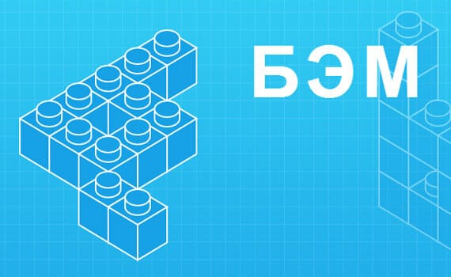
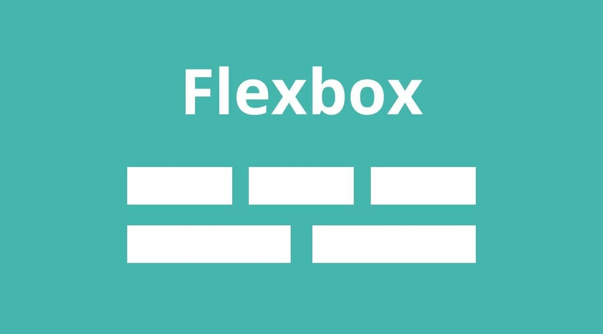

<h1 align="center"># Cripta-Layout</h1>

🎓<strong>Вёрстка макета была сделана для сдачи зачёта по ОВР (Основы Веб-Разработки) в моём университете</strong>🎓

<h2>## Особенности Вёрстки</h2>
<strong>В данной вёрстке использовались: 
 
Язык гипертекстовой разметки(HTML) 

 
Каскадная Таблица Стилей(CSS)</strong> 

 
Методология BEM 

 
 
Концепция FlexBox 

 
 
Правила Медиа-Запросов 

 
 

<h3>## <strong>Для чего были выбраны - Методология БЭМ, Концепция FlexBox и Правила Медиа-Запросов?</strong></h3>

1. Методология БЭМ

Данная методология применялась в данной вёрстке для читабельности кода 
удобства переиспользования однотипных элементов, которые повторялись в макете 
и удобной стилизации в CSS 

2. Концепция FlexBox

Данная концепция использовалась  
для создания небольшой адаптивности элементов вёрстки 
и помогла сделать сайт гибким. 

3. Правила Медиа-Запросов

Они необходимы, ведь они помогают создать 
удобства пользователей на разных устройствах. 
Сайт может работать не только на ПК, но и планшетах, и телефонах, 
и иных устройствах 

